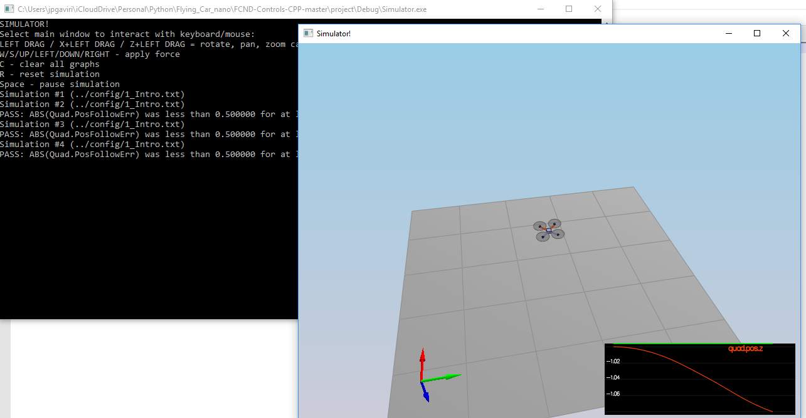
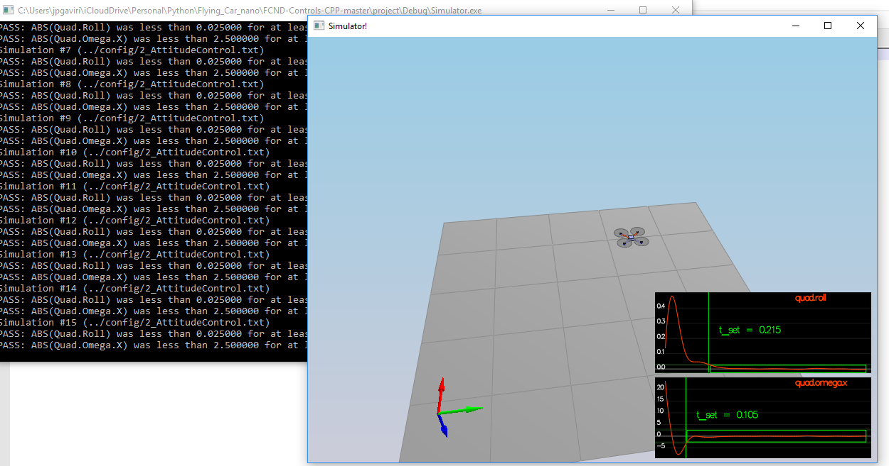
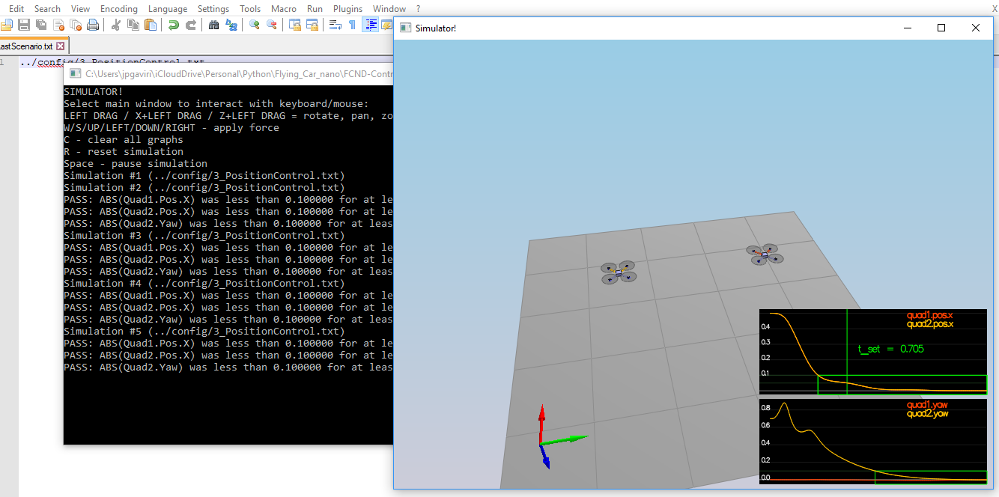
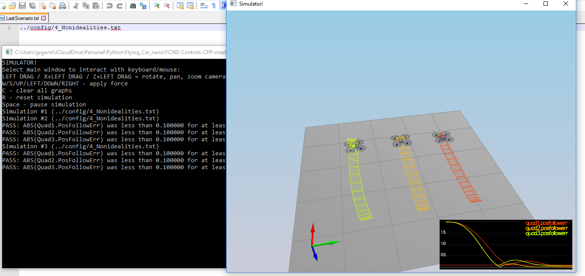
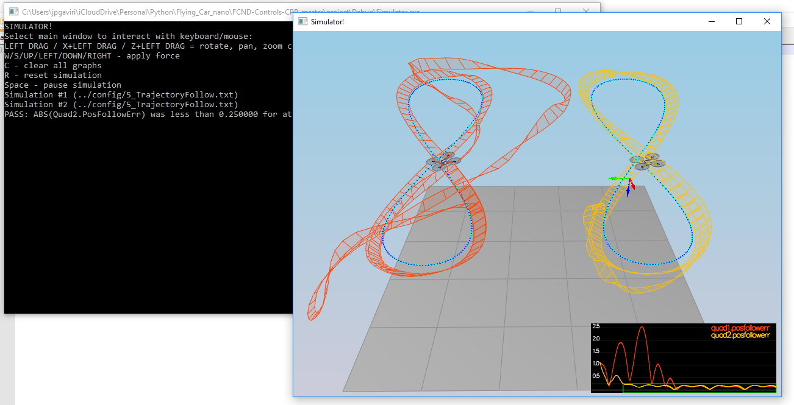

# The C++ Project Writeup #

This is the writeup for the C++ project.

For easy navigation throughout this document, here is an outline:

 - [Implemented Controller](#implemented-controller)
 - [Flight Evaluation](#flight-evaluation)
 - [Extra Challenge 1](#extra-challenge)
 - [Extra Challenge 2](#estra-challenge2)

## Implemented Controller ##

### Implemented body rate control in C++. ###

Implemented a P controller for roll, pitch and yaw body rates
Multiply the body rate command by the moment of inertia of each axis

### Implement roll pitch control in C++. ###

This function takes local x and y acelerations and converts them to roll and pitch body rate commands, Yaw rate command is sent as 0

The controller used was a P controller for roll and pitch rates. The Max tilt angle was supposed to be used, however we do not have direct access to pitch and roll angles, I implemented the limit on the error before passing it to the controller.

Used math from 3D drone excercise to convert from local to body rates 

### Implement altitude controller in C++. ###

Implemented cascaded P and PI controllers for altitude control

First P controller takes position error and velocity feed forward to come up with a velocity command

the velocity command is limited on the ascend/descend rate before passing it to the acceleration P controller

The second PI controller takes filtered velocity command and integrated altitude error to calculate an acceleration command.

Since NED coordinates positive position is down, we change the direction of the controller output and add it to the gravity to come up with a delta acceleration. Using math from drone3D excercise we have to divide by the rotation matrix term that includes the drone attitude, if it is completely flat then the division is just 1

Thrust is a force, so in order to get a force we need to multiply the acceleration by the mass.

### Implement lateral position control in C++. ###

Lateral controller takes local position and outputs local X and Y accelerations.

Implemented cascaded P controllers to first go from position to velocity command with velocity Feed forward. Then filter the velocity command with the maxSpeedXY

Second P controller takes limited velocity command and feed forward acceleration to come up with an acceleration command, then filter the output of the controller for maxAccelXY

Set Z acceleration as 0, this is not used, the altitude controller takes care of Z

### Implement yaw control in C++. ###

Yaw control is a straightforward P controller, calculates yaw error to come up with a yawrate command, limit the output from -pi to pi

### Implement calculating the motor commands given commanded thrust and moments in C++. ###

This function takes the thrust and rotation moments about each axis

for each motor we need to that 2 motors rotate clockwise and 2 rotate counterclockwise to counteract each other.

Then for each motor add the moments and then divide by 4 as the total needs to be split between the 4 motors.

## Flight Evaluation ##

### Implement calculating the motor commands given commanded thrust and moments in C++. ###
- Scenario 1

- Scenario 2

- Scenario 3

- Scenario 4

- Scenario 5

## Extra Challenge 1 ##

You will notice that initially these two trajectories are the same. Let's work on improving some performance of the trajectory itself.

1. Inspect the python script `traj/MakePeriodicTrajectory.py`.  Can you figure out a way to generate a trajectory that has velocity (not just position) information?
- Done, made the changes to the file to generate velocity

2. Generate a new `FigureEightFF.txt` that has velocity terms
Did the velocity-specified trajectory make a difference? Why?
- yes it made an improvement, the drone was able to follow the trajectory better, this is because on the controller I'm using velocity FF to help the controller, prior to this velocity cmd _ff was 0

## Extra Challenge 2 ##

For flying a trajectory, is there a way to provide even more information for even better tracking?
- yes I further modified the file to also calculate predicted accelerations, this made the file track almost perfectly, the first drone after a little bit matches exaclty the other drone path.

How about trying to fly this trajectory as quickly as possible (but within following threshold)!
- I'm able to fly it faster, but I was unabel to fine tune the first drone to be smoother at the beginining.

