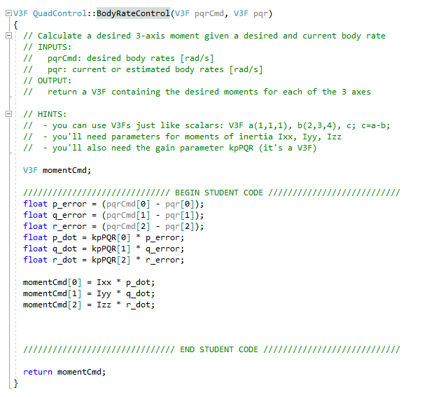
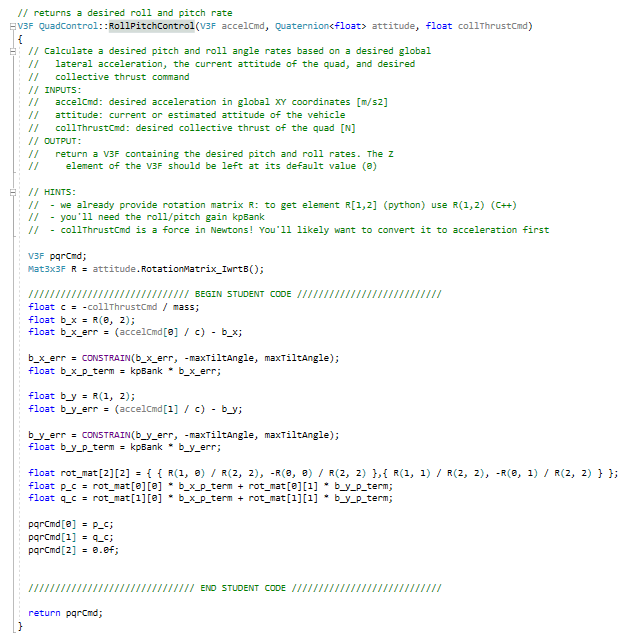
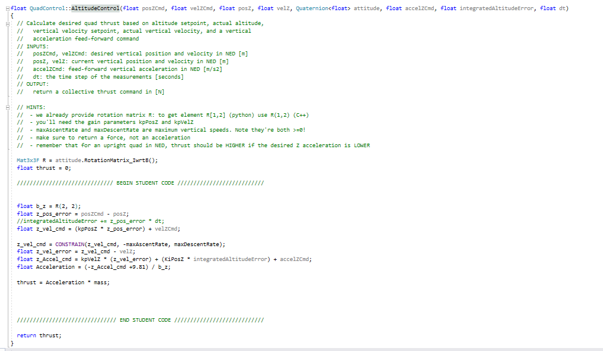
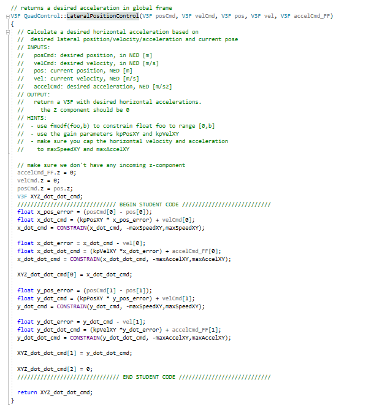
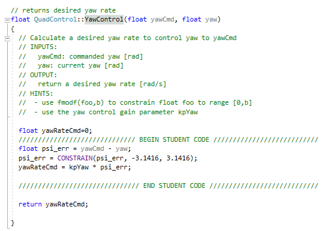
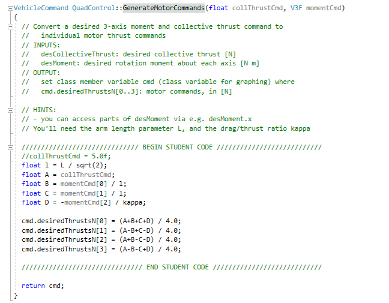

# The C++ Project Writeup #

This is the writeup for the C++ project.

For easy navigation throughout this document, here is an outline:

 - [Implemented Controller](#implemented-controller)
 - [Flight Evaluation](#flight-evaluation)
 - [Extra Challenge 1](#extra-challenge)

## Implemented Controller ##

# Implemented body rate control in C++. #

# Implement roll pitch control in C++.

# Implement altitude controller in C++.

# Implement lateral position control in C++.

# Implement yaw control in C++.

# Implement calculating the motor commands given commanded thrust and moments in C++.

## Flight Evaluation ##

# Implement calculating the motor commands given commanded thrust and moments in C++.
- Scenario 1

- Scenario 2

- Scenario 3

- Scenario 4

- Scenario 5

## Extra Challenge 1 ##

You will notice that initially these two trajectories are the same. Let's work on improving some performance of the trajectory itself.

1. Inspect the python script `traj/MakePeriodicTrajectory.py`.  Can you figure out a way to generate a trajectory that has velocity (not just position) information?
- Done, made the changes to the file to generate velocity

2. Generate a new `FigureEightFF.txt` that has velocity terms
Did the velocity-specified trajectory make a difference? Why?
- yes it made an improvement, the drone was able to follow the trajectory better, this is because on the controller I'm using velocity FF to help the controller, prior to this velocity cmd _ff was 0

### Extra Challenge 2 (Optional) ###

For flying a trajectory, is there a way to provide even more information for even better tracking?
- yes I further modified the file to also calculate predicted accelerations, this made the file track almost perfectly, the first drone after a little bit matches exaclty the other drone path.

How about trying to fly this trajectory as quickly as possible (but within following threshold)!
- I'm able to fly it faster, but I was unabel to fine tune the first drone to be smoother at the beginining.

