# Estimation Project #


## The Tasks ##

Here is the explanation on what I did to pass all the scenarios

Project outline:

 - [Step 1: Sensor Noise](#step-1-sensor-noise)
 - [Step 2: Attitude Estimation](#step-2-attitude-estimation)
 - [Step 3: Prediction Step](#step-3-prediction-step)
 - [Step 4: Magnetometer Update](#step-4-magnetometer-update)
 - [Step 5: Closed Loop + GPS Update](#step-5-closed-loop--gps-update)
 - [Step 6: Adding Your Controller](#step-6-adding-your-controller)


### Step 1: Sensor Noise ###

1. Ran Scenario `06_NoisySensors` and produced the graph 1 and graph 2 text files for (GPS X data) and (Accelerometer X data)

2. Changed extension of each of the files to .csv and imported them in excel and used excel to calculate standard deviation

3. found the std deviations to be 0.70062 for GPS X data and 0.476429 for Accelerometer X data

4. Pluged in my calculated std deviations into the file `config/6_Sensornoise.txt` and re-ran the test and this time it passed

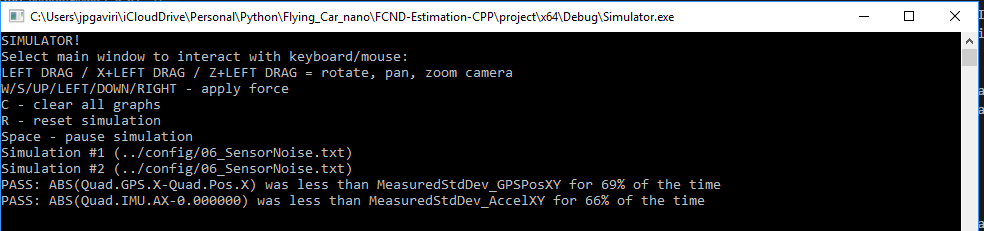

### Step 2: Attitude Estimation ###

1. Implemented `UpdateFromIMU()` function of `QuadEstimatorEKF.cpp` 
- I used the option 2 in the hints to simplify my implementation, that way I don't have to create a rotation matrix.
- Create a quaternion class object from the roll, pitch and yaw
- Use the bult in function of the quaternon class to integrate using giro and DT of the IMU
- Get the integrated pitch, roll and yaw to be used on the integraton and update function
- normalize yaw to -pi .. pi
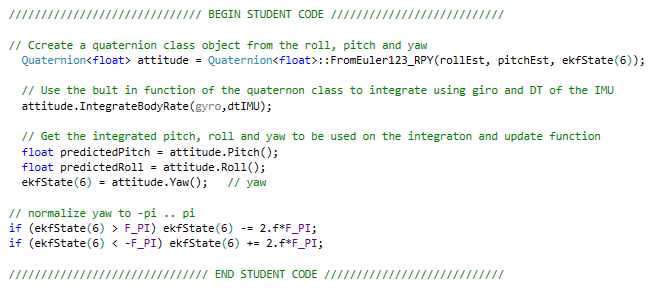

2. After the implementing the complementary filter the test passed

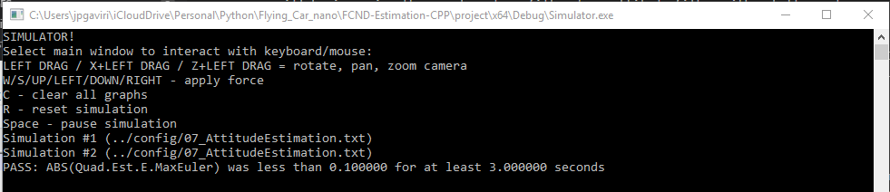

### Step 3: Prediction Step ###

In this next step you will be implementing the prediction step of your filter.

1. Implemented `PredictState()` function in `QuadEstimatorEKF.cpp`
- Rotate the acceleration vector into the Inertial frame to be able to use it on the predict function
- Update all state matrix components taking the current one and adding the integral with time.
- For Z acceleration we need to substract gravity
- For yaw we were told that the IMU already includes the integration, so we just pass the current state from IMU.
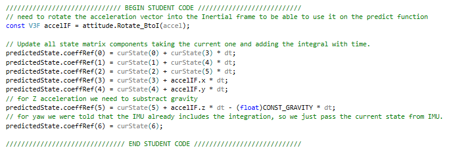

2. Implemented `GetRbgPrime()` in `QuadEstimatorEKF.cpp` following the math from the document
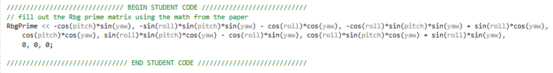

3. Implemented `Predict()` function in `QuadEstimatorEKF.cpp` to predict the covariance forward
- Fill out g prime matrix using the document
- Update covariance matrix g Prime and the model covariance Q
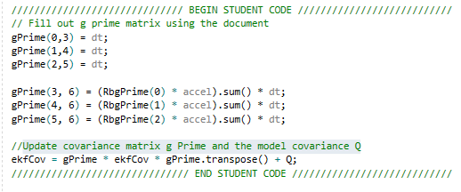

4. Tuned QPosXYStd and the QVelXYStd in `QuadEstimatorEKF.txt` to try to find a reasonable plot. there are no pass or fail criteria for this step so I made it look similar to the good solution in the readme.


### Step 4: Magnetometer Update ###

1. Tuned QYawStd in `QuadEstimatorEKF.txt` to capture the magnitude of the drift

2. Implemented `UpdateFromMag()` function in `QuadEstimatorEKF.cpp`
- Update zFromX from the predicted state
- Normalize zfromX from - Pi to Pi to avoid jumps
- Fill out h prime as per the document for a magnetometer
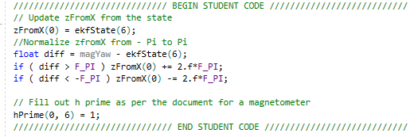

3. After implementing the function the test passed.
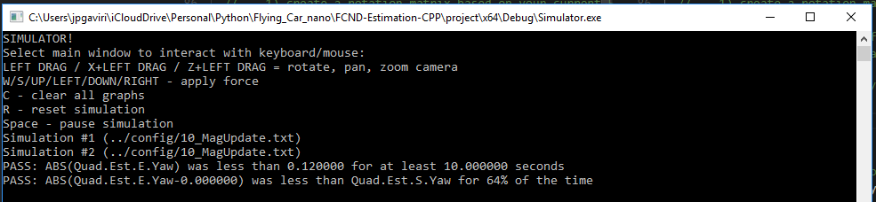

4. After implementing my controller from step 6, I had to retune the controller to be able to pass the step.

### Step 5: Closed Loop + GPS Update ###

1. Set `Quad.UseIdealEstimator` to 0 in `config/11_GPSUpdate.txt` then commenting out these lines in `config/11_GPSUpdate.txt`:
```
#SimIMU.AccelStd = 0,0,0
#SimIMU.GyroStd = 0,0,0
```
2. Tuned the process noise model in `QuadEstimatorEKF.txt` to capture the error

3. Implemented the EKF GPS Update in the function `UpdateFromGPS()`.
- Update zfromX using the state
- fill out h prime as per the document
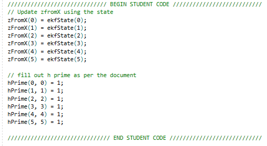

6. After implementing the function, ran the simulation and passed the test.
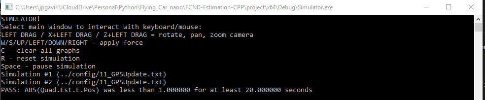

### Step 6: Adding Your Controller ###

Up to this point, we have been working with a controller that has been relaxed to work with an estimated state instead of a real state.  So now, you will see how well your controller performs and de-tune your controller accordingly.

1. Merged `QuadController.cpp` with the controller I wrote in the last project, I could not do straight copy paste as I had done changes to the altitude function on the project and it was not compiling

2. Replaced `QuadControlParams.txt` with the control parameters I tuned in the last project.

3. Ran scenario `11_GPSUpdate`. and tuned the controller to be able to pass scenario 10 and 11. As suggested by the help I had to decrease the position and velocity gains, at the end both test pass OK.

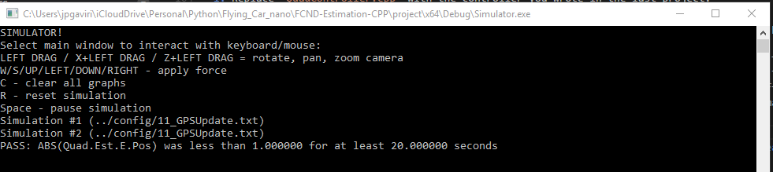
