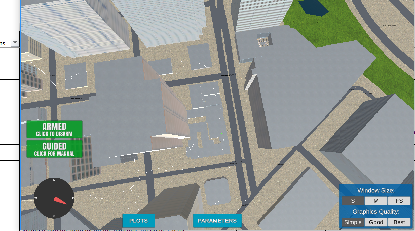
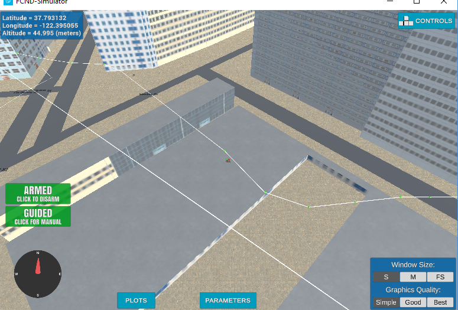

## Project: 3D Motion Planning

---

# Required Steps for a Passing Submission:
1. Load the 2.5D map in the colliders.csv file describing the environment.
2. Discretize the environment into a grid or graph representation.
3. Define the start and goal locations.
4. Perform a search using A* or other search algorithm.
5. Use a collinearity test or ray tracing method (like Bresenham) to remove unnecessary waypoints.
6. Return waypoints in local ECEF coordinates (format for `self.all_waypoints` is [N, E, altitude, heading], where the drone’s start location corresponds to [0, 0, 0, 0].
7. Write it up.
8. Congratulations!  Your Done!

## [Rubric](https://review.udacity.com/#!/rubrics/1534/view) Points
### Here I will consider the rubric points individually and describe how I addressed each point in my implementation.  

---
### Writeup / README

#### 1. Provide a Writeup / README that includes all the rubric points and how you addressed each one.  You can submit your writeup as markdown or pdf.  

You're reading it! Below I describe how I addressed each rubric point and where in my code each point is handled.

### Explain the Starter Code

#### 1. Explain the functionality of what's provided in `motion_planning.py` and `planning_utils.py`
**MOTION_PLANNING.PY**
Motion Planning is a similar to backyard flyier, except that now there is a new state called PLANNING, this state is called
after ARMING and before TAKEOFF state and it serves as a state to calculate the complete route before taking off 

There is also a new fuction that sends the waypoints for visualization to the simulator called send_waypoints()

Function plan_path() is the one responsible to to plan the entire trip for the drone

**PLANNING_UTILS.PY**
This module contains basic functions to help us plan the mission, this saves us from having to implement all common functions for planning a flight, now we can just import functions from planning_utils.py
I added some other functions to this module, I added prune_path, find_start_goal, a_star and get3DPath

### Implementing Your Path Planning Algorithm
I tried 3 different of methods:

**motion_planner.py:** This is the original from the excercise that is used in motion_planning.py, it was memory intensive so I discarded it quickly, it was also not safe as it will find a path very close to buildings.

**motion_planner2.py:** This method was using probabilistic method, I created the sampler class and I found this method to be complicated, in order to be able to get a path I needed to have aroound 300 sample points and it will not always find a path, it was also very memory intensive and slow

**motion_planner3.py:** This method I used medial-axis. This provided me a very safe path and very quick planning method. Knowing I was on the safest path it allowed me to relax the tolerances on the prune_path function and also between waypoints, the drone is able to travel very fast between 2 places on the grid.
To be able to go from anywhere to anywhere on the grid I created a replanning function that in case a path is not possible then just add 20 meters to the cruise altitude, find a new skeleton and try a_star again, this enabled me to make a 3D planning function that will always work, the drone is able to land on the roof of buildings, even in Hollow buildings.
Something I really Appreciated of medial axis is that it creates safe airways at different altitudes, similar to how aircraft fly between cities in the world.
I tried to implement a function in planning utils to see if I could prune the path even more by checking if I can go direct-to from waypoint i to waypoint i+2 then pop waypoint i+1, it seemed to work sometimes, but I had issues with the function to check if a line crosses a polygon, sometimes it would just let me crash into buildings.

At the end, my **motion_planner3.py** is the best method, quick, efficient and safe.

here are some snapshots of plans going from all places in the map

#### 1. Set your global home position
Here students should read the first line of the csv file, extract lat0 and lon0 as floating point values and use the self.set_home_position() method to set global home. Explain briefly how you accomplished this in your code.

Not the cleanest of ways, but got what I needed, I read the entire csv using csv.reader function, extracted first line
then I deleted lat lon and spaces then converted the numbers from the string to float

**probably the np.genfromtxt fuction could have done this, but I was not able**
to find the way, used csv.reader to get it

latlondata = csv.reader(open('colliders.csv', newline=''), delimiter=',')

for row in latlondata:

    lat0, lon0 = row[:2]

    break

lat0 = lat0.replace("lat0 ","")

lon0 = lon0.replace(" lon0 ","")

lat0 = float(lat0)

lon0 = float(lon0)

#### 2. Set your current local position
Here as long as you successfully determine your local position relative to global home you'll be all set. Explain briefly how you accomplished this in your code.
- set global home with the lat0 lon0 retrieved from the csv file
- got the actual global position from the drone
- used global_to_local function to get the local position relative to home.

#### 3. Set grid start position from local position
This is another step in adding flexibility to the start location. As long as it works you're good to go!
Get local grid position and determine the new grid start from global home then
add it to grid center 
- Determine new local current with respect to grid center
Localcurrent = global_to_local(self.global_position,self.global_home)
- Get the new grid start position, add grid center position to the new local position
grid_start = (int(-grid_center[0]+Localcurrent[0]),int(-grid_center[1]+Localcurrent[1]))
-Added the code below in case I'm taking off from a Building, therefore the cruise altitude is higher
If local position is not at altitude 0, update the altitute for takeoff
if -Localcurrent[2] > TARGET_ALTITUDE:
            TARGET_ALTITUDE = int(TARGET_ALTITUDE -Localcurrent[2])
            self.target_position[2] = TARGET_ALTITUDE

#### 4. Set grid goal position from geodetic coords
This step is to add flexibility to the desired goal location. Should be able to choose any (lat, lon) within the map and have it rendered to a goal location on the grid.
- Added a global variable: UseLatLonAlt to be able to select if I want local or global position goal.
- Also added grid_goal_lat_lon_alt global variable to easily be able to select different goal positions on the map
- get goal local position using the global_to_local function
grid_goal = global_to_local(grid_goal_lat_lon_alt,self.global_home)
- add the north and east offset from the center to determine the true local goal position with respect to grid center.
grid_goal = tuple((int(grid_goal[0]-north_offset),int(grid_goal[1]-east_offset)))

#### 5. Modify A* to include diagonal motion (or replace A* altogether)
Minimal requirement here is to modify the code in planning_utils() to update the A* implementation to include diagonal motions on the grid that have a cost of sqrt(2), but more creative solutions are welcome. Explain the code you used to accomplish this step.

On the planning_utils.py Action Class, added the following actions and defined the cost as sqrt(2)
""" Added diagonal motions with a cost os square root of 2"""

**NORTH_WEST = (-1, -1, np.sqrt(2))**

**NORTH_EAST = (-1, 1, np.sqrt(2))**

**SOUTH_WEST = (1, -1, np.sqrt(2))**

**SOUTH_EAST = (1, 1, np.sqrt(2))**

On the valid actions function added the following code to qualify if the diagonal action is valid

**if (x - 1 < 0 or y - 1 < 0) or grid[x - 1, y - 1] == 1:**
    **valid_actions.remove(Action.NORTH_WEST)**

**if (x - 1 < 0 or y + 1 > m) or grid[x - 1, y + 1] == 1:**
    **valid_actions.remove(Action.NORTH_EAST)**

**if (x + 1 > n or y - 1 < 0) or grid[x + 1, y - 1] == 1:**
    **valid_actions.remove(Action.SOUTH_WEST)**

**if (x + 1 > n or y + 1 > m) or grid[x + 1, y + 1] == 1:**
    **valid_actions.remove(Action.SOUTH_EAST)**

#### 6. Cull waypoints 
For this step you can use a collinearity test or ray tracing method like Bresenham. The idea is simply to prune your path of unnecessary waypoints. Explain the code you used to accomplish this step.

- Implemented Prune_path function on the planning_utils.py, relaxed the threshold to 5.0 from Epsilon to remove a lot of points, since I was using medial axis I had a lot of room to relax the tolerances.

### Execute the flight
#### 1. Does it work?
It works great!

### Double check that you've met specifications for each of the [rubric](https://review.udacity.com/#!/rubrics/1534/view) points.
  
# Extra Challenges: Real World Planning

For an extra challenge, consider implementing some of the techniques described in the "Real World Planning" lesson. You could try implementing a vehicle model to take dynamic constraints into account, or implement a replanning method to invoke if you get off course or encounter unexpected obstacles.

I tried implementing Probablistic method in motion_planning2.py to be able to fly in 3D, but I found it to be really expensive in terms of computational power, and I did not get a consistent path, instead I created a medial axis method adapter to a 3D world and found it to be expremely fast and safe, that allowed me to relax the tolerances on the prune_path function as well as on the  flight state

And here's a lovely image of my results (ok this image has nothing to do with it, but it's a nice example of how to include images in your writeup!)

Here's | A | Snappy | Table
--- | --- | --- | ---
1 | `highlight` | **bold** | 7.41
2 | a | b | c
3 | *italic* | text | 403
4 | 2 | 3 | abcd

